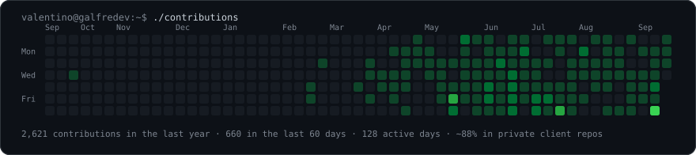
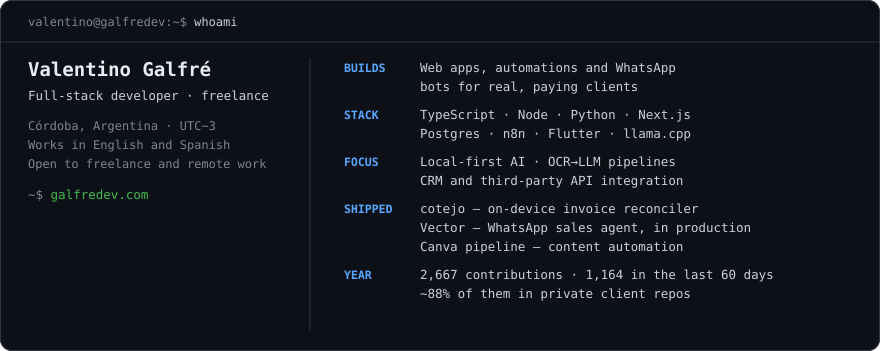

<h3><code>valentino@galfredev:~$ ./contributions</code></h3>

Most of that green is private client work, which is why the public star count is what it is. The graph is regenerated every morning from the GitHub API by [a workflow in this repository](./.github/workflows/update-profile-art.yml), and the SVG is committed here — so nothing on this page depends on a third-party service staying up.

<h3><code>valentino@galfredev:~$ whoami</code></h3>

Card contents as text

<!-- The card above is an SVG, so its text is neither indexed nor read aloud.
     This mirror is the accessible and searchable copy. -->

- **Role** — Full-stack developer · freelance
- **Based** — Córdoba, Argentina · UTC−3 · works in English and Spanish
- **Builds** — Web apps, automations and WhatsApp bots for real, paying clients
- **Stack** — TypeScript · Node · Python · Next.js · Postgres · n8n · Flutter · llama.cpp
- **Focus** — Local-first AI, OCR→LLM pipelines, CRM and third-party API integration
- **Shipped** — [cotejo](https://github.com/valentinogalfre/cotejo) (on-device invoice reconciler) · [Vector](https://github.com/valentinogalfre/vector-galfredev-bot) (WhatsApp sales agent, in production) · [Canva pipeline](https://github.com/valentinogalfre/automatizacion-notas-canva) (content automation)
- **Open to** — Freelance and remote work

🇦🇷 <b>¿Hablás español?</b> · <a href="./README.es.md">Leer en español</a> · <a href="https://galfredev.com">galfredev.com</a>

